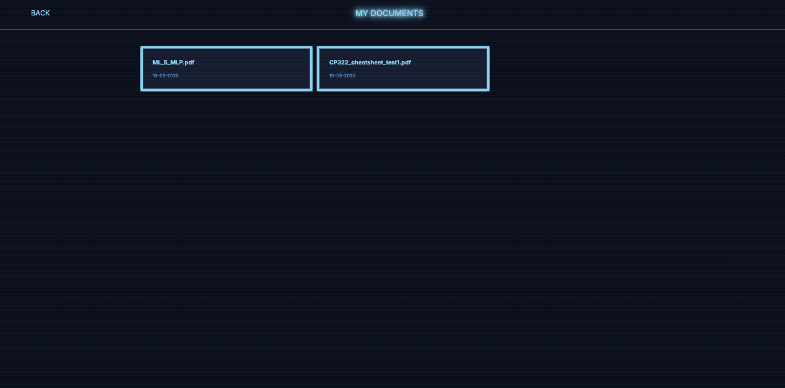
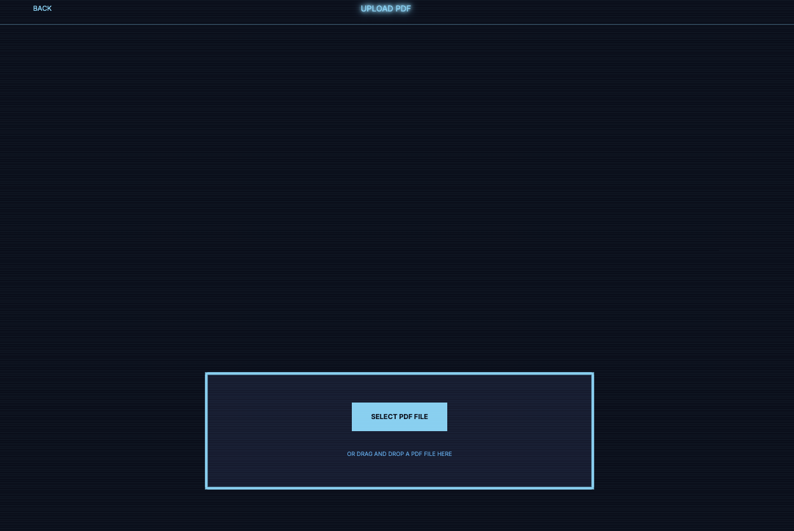
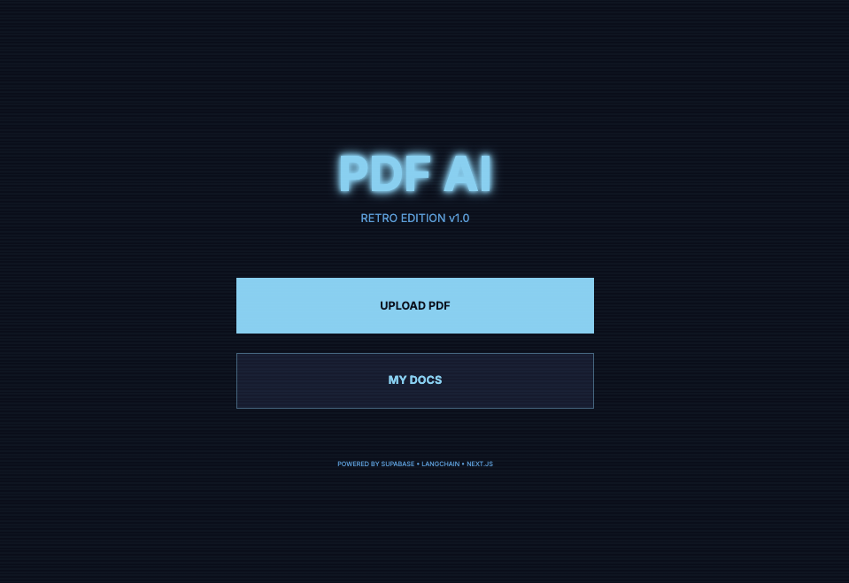
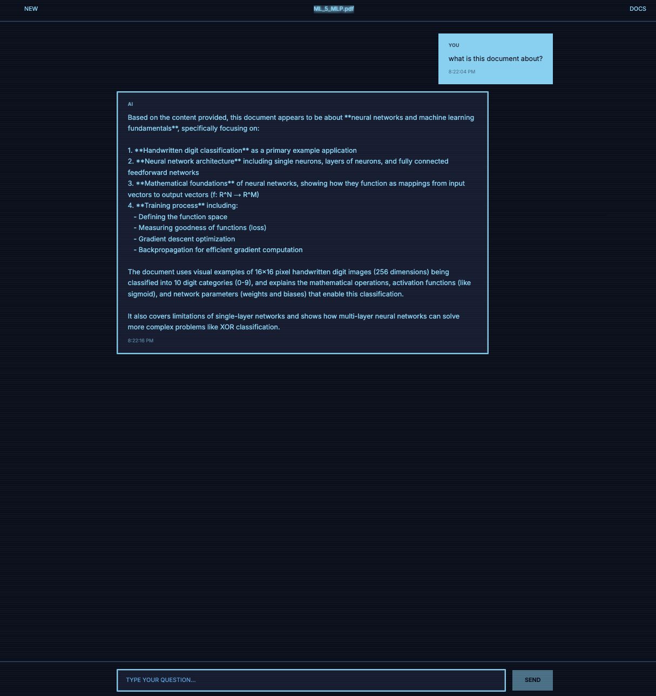

# PDF AI Chat

A full-stack AI-powered PDF chat application with a retro Severance-inspired UI. Upload PDF documents and have intelligent conversations with them using RAG (Retrieval Augmented Generation).



## ✨ Features

- 🤖 **AI-Powered Chat**: Interact with your PDF documents using DeepSeek LLM
- 🔍 **Vector Search**: Fast semantic search powered by Supabase pgvector
- 🎨 **Retro UI**: Severance Apple TV show inspired design with cyberpunk aesthetics
- 📄 **PDF Processing**: Automatic text extraction and intelligent chunking
- 💬 **Conversational Context**: Maintains conversation history for natural dialogue
- 🗂️ **Document Management**: Upload, view, and delete your PDF documents

## 🖼️ Screenshots

### Landing Page
The main interface with upload and document management options.


### Upload PDF
Simple drag-and-drop or click-to-upload interface.



### Document Library
View all your uploaded PDFs with timestamps.



### Chat Interface
Have natural conversations about your document content.



## 🛠️ Tech Stack

### Backend
- **Node.js + Express**: REST API server
- **TypeScript**: Type-safe development
- **LangChain**: LLM orchestration framework
- **DeepSeek**: Large language model for chat
- **Hugging Face**: Embeddings (sentence-transformers/all-MiniLM-L6-v2)
- **pdf-parse**: PDF text extraction
- **Supabase**: PostgreSQL database with pgvector extension

### Frontend
- **Next.js 14**: React framework with App Router
- **TypeScript**: Type-safe development
- **Tailwind CSS**: Utility-first styling
- **Press Start 2P**: Retro pixel font
- **Custom CSS**: Scanlines, pixel borders, and CRT effects

## 🚀 Getting Started

### Prerequisites
- Node.js 18+ 
- npm or yarn
- Supabase account
- DeepSeek API key
- Hugging Face API key (free tier available)

### 1. Clone the Repository
```bash
git clone https://github.com/souppman/PDF-Chat.git
cd PDF-Chat
```

### 2. Install Dependencies
```bash
npm run install:all
```

### 3. Set Up Supabase

Create a new Supabase project, then run this SQL in the SQL Editor:

```sql
-- Enable the pgvector extension
create extension if not exists vector;

-- Drop existing if changing dimensions
drop function if exists match_documents(vector, int, jsonb);
drop table if exists documents;

-- Create documents table
create table documents (
  id bigserial primary key,
  content text,
  metadata jsonb,
  embedding vector(384) -- 384 dimensions for sentence-transformers/all-MiniLM-L6-v2
);

-- Create similarity search function
create function match_documents (
  query_embedding vector(384),
  match_count int DEFAULT null,
  filter jsonb DEFAULT '{}'
) returns table (
  id bigint,
  content text,
  metadata jsonb,
  embedding jsonb,
  similarity float
)
language plpgsql
as $$
#variable_conflict use_column
begin
  return query
  select
    id,
    content,
    metadata,
    (embedding::text)::jsonb as embedding,
    1 - (documents.embedding <=> query_embedding) as similarity
  from documents
  where metadata @> filter
  order by documents.embedding <=> query_embedding
  limit match_count;
end;
$$;
```

### 4. Configure Environment Variables

**Backend** (`backend/.env`):
```env
PORT=3005
SUPABASE_URL=your_supabase_project_url
SUPABASE_SERVICE_KEY=your_supabase_service_role_key
DEEPSEEK_API_KEY=your_deepseek_api_key
DEEPSEEK_API_BASE=https://api.deepseek.com/v1
HUGGINGFACE_API_KEY=your_huggingface_api_key
FRONTEND_URL=http://localhost:3000
```

**Frontend** (`frontend/.env.local`):
```env
NEXT_PUBLIC_SUPABASE_URL=your_supabase_project_url
NEXT_PUBLIC_SUPABASE_ANON_KEY=your_supabase_anon_key
NEXT_PUBLIC_API_URL=http://localhost:3005
```

### 5. Run the Application

Development mode (runs both backend and frontend):
```bash
npm run dev
```

Or run them separately:
```bash
# Terminal 1 - Backend
npm run dev:backend

# Terminal 2 - Frontend
npm run dev:frontend
```

The application will be available at:
- Frontend: http://localhost:3000
- Backend API: http://localhost:3005

## 📁 Project Structure

```
pdfchat/
├── backend/
│   ├── src/
│   │   ├── config/         # Supabase configuration
│   │   ├── routes/         # API endpoints
│   │   ├── services/       # Business logic
│   │   │   ├── chatService.ts      # LLM & embeddings
│   │   │   ├── pdfService.ts       # PDF parsing
│   │   │   └── vectorService.ts    # Vector operations
│   │   ├── types/          # TypeScript types
│   │   └── server.ts       # Express server
│   ├── package.json
│   └── tsconfig.json
├── frontend/
│   ├── app/
│   │   ├── globals.css     # Global styles
│   │   ├── layout.tsx      # Root layout
│   │   └── page.tsx        # Main page
│   ├── components/
│   │   ├── ChatInterface.tsx
│   │   ├── DocumentList.tsx
│   │   └── PDFUploader.tsx
│   ├── lib/
│   │   └── api.ts          # API client
│   ├── package.json
│   └── tsconfig.json
├── package.json            # Root package.json
└── README.md
```

## 🔑 API Endpoints

### PDF Management
- `POST /api/pdf/upload` - Upload and process a PDF
- `GET /api/pdf/documents` - List all documents
- `DELETE /api/pdf/:documentId` - Delete a document

### Chat
- `POST /api/chat` - Send a message and get AI response

### Health
- `GET /health` - API health check

## 🎨 Design Features

The UI is inspired by the Severance Apple TV show computers:
- **Color Palette**: Deep blue-black backgrounds with cyan/light blue accents
- **Typography**: Press Start 2P pixel font for retro feel
- **Effects**: CRT scanlines, pixel borders, and glow effects
- **Layout**: Minimal, institutional aesthetic

## 🔒 Security Notes

- Use service role keys only in backend (never expose in frontend)
- Keep API keys in environment variables
- The backend uses CORS to restrict frontend origins
- Always validate and sanitize file uploads

## 📝 How It Works

1. **Upload**: User uploads a PDF file
2. **Processing**: Backend extracts text and splits into chunks
3. **Embedding**: Each chunk is converted to a 384-dimensional vector using Hugging Face
4. **Storage**: Chunks and embeddings are stored in Supabase
5. **Query**: User asks a question about the document
6. **Search**: Question is embedded and similar chunks are found via vector search
7. **Generation**: DeepSeek LLM generates a response using relevant chunks as context

## 🤝 Contributing

Contributions are welcome! Please feel free to submit a Pull Request.

## 📄 License

MIT License - feel free to use this project for learning or commercial purposes.

## 🙏 Acknowledgments

- [DeepSeek](https://www.deepseek.com/) for the LLM
- [Supabase](https://supabase.com/) for the database and vector storage
- [LangChain](https://www.langchain.com/) for LLM orchestration
- [Hugging Face](https://huggingface.co/) for embeddings
- Severance (Apple TV+) for design inspiration

## 📞 Support

For issues and questions, please open an issue on GitHub.

---

Built with ❤️ using TypeScript, Next.js, and Express

